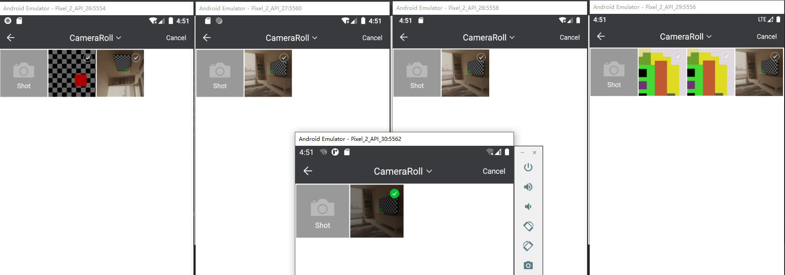

# CoilEngine 兼容Android版本示例工程

源项目：[PictureSelector](https://github.com/LuckSiege/PictureSelector)

不同版本运行结果：



## 操作步骤
- 1. 将这个类复制到自己的工程中
> https://github.com/ijero/CoilPictureSelector/blob/master/app/src/main/java/cn/ijero/coilpictureselector/CoilEngine.kt

## 视频缩略图支持
- 引入Coil依赖的时候要增加coil-video库：

```grovvy
// coil
implementation("io.coil-kt:coil:1.3.2")
implementation("io.coil-kt:coil-gif:1.3.2")
implementation("io.coil-kt:coil-video:1.3.2")
```

## 调用方式：

```kotlin
  PictureSelector.create(context)
                .openGallery(PictureMimeType.ofImage()) // 全部.PictureMimeType.ofAll()、图片.ofImage()、视频.ofVideo()、音频
                .theme(R.style.picture_default_style) //主题样式(不设置为默认样式)
                .imageEngine(CoilEngine.instance)
                .selectionMode(PictureConfig.MULTIPLE)// 多选 or 单选 PictureConfig.MULTIPLE or PictureConfig.SINGLE
                .isCamera(true) // 是否显示拍照按钮 true or false
                .isZoomAnim(true) // 图片列表点击 缩放效果 默认true
                .maxSelectNum(selectNum) // 最大图片选择数量 int
                .imageSpanCount(4)// 每行显示个数 int
                .selectionData(pathList)// 是否传入已选图片 List list
                .isPreviewImage(true) //是否可预览图片 true or false
                .isPreviewEggs(true)//预览图片时 是否增强左右滑动图片体验(图片滑动一半即可看到上一张是否选中) true
                .isEnableCrop(false)//是否开启裁剪
                .isCompress(true) //是否压缩
                .minimumCompressSize(100)// 小于100kb的图片不压缩
                .compressQuality(80)// 压缩质量 默认90 int
                .isReturnEmpty(false)//未选择数据时按确定是否可以退出
                .forResult(PictureConfig.CHOOSE_REQUEST)
```
